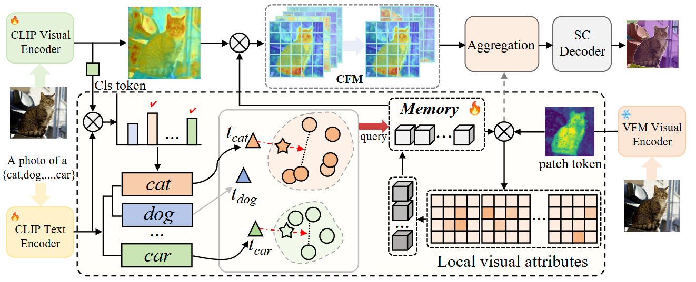

# Rethinking Text-Vision Alignment: Hybrid Global-Local Embedding Optimization for Open-Vocabulary Semantic Segmentation
This is our official implementation of TVA-Seg! 


## Introduction


## Create Conda Environment
```
conda create -n TVA-Seg python=3.10.0
conda activate TVA-Seg
Install a torch that matches your CUDA version from the official website: https://pytorch.org/get-started/previous-versions/, The environment we are using is CUDA11.7+TORCH2.0.0.

pip install torch==2.0.0 torchvision==0.15.1 torchaudio==2.0.1
pip install -r requirements.txt
pip install -e . -v
```

## Data Preparation
Please follow [dataset preperation](datasets/README.md).

## Training
We provide shell scripts for training and evaluation. ```run.sh``` trains the model in default configuration and evaluates the model after training. 

To train or evaluate the model in different environments, modify the given shell script and config files accordingly.

### Training script
```bash
sh run.sh [CONFIG] [NUM_GPUS] [OUTPUT_DIR] [OPTS]

# For ViT-B variant
sh run.sh configs/vitb_384.yaml 4 output/
# For ViT-L variant
sh run.sh configs/vitl_336.yaml 4 output/
```

## Evaluation
```eval.sh``` automatically evaluates the model following our evaluation protocol, with weights in the output directory if not specified.
To individually run the model in different datasets, please refer to the commands in ```eval.sh```.

### Evaluation script
```bash
sh run.sh [CONFIG] [NUM_GPUS] [OUTPUT_DIR] [OPTS]

sh eval.sh configs/vitl_336.yaml 4 output/ MODEL.WEIGHTS path/to/weights.pth
```

